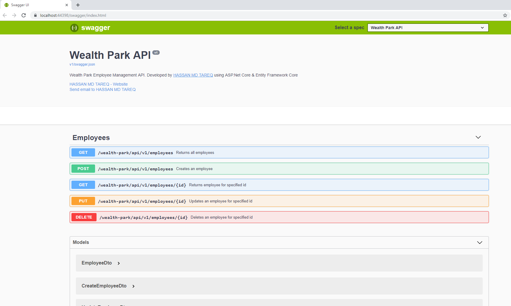
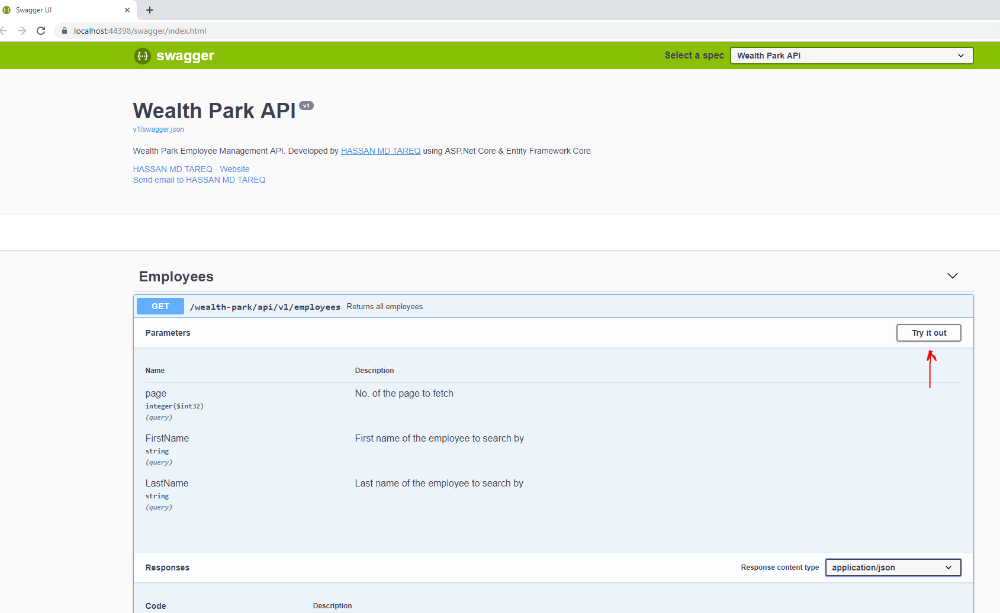

# Required to run
* Visual Studio 2019
* .Net Core SDK 2.2

# Used technologies and tools
* ASP.NET Core
* Entity Framework Core
* Swashbuckle - Open API (Swagger) doc generator
* xUnit
* Autofixure
* Moq
* Serilog

## Instructions
Clone the repo and run the app in VS 2019, it will launch SwaggerUI. Use SwaggerUI's "Try It Out" to test the api.

#### Initial view

#### After expanding

